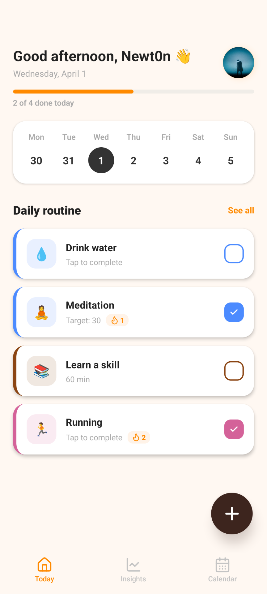
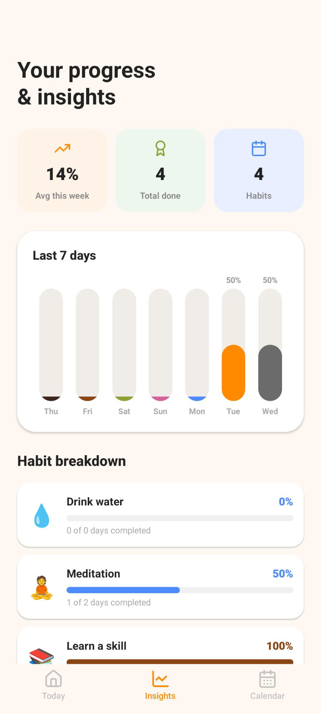
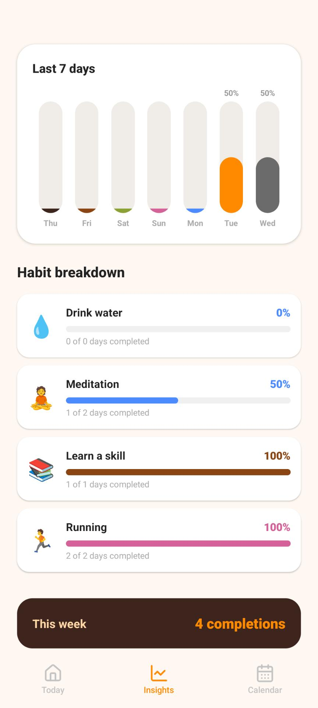
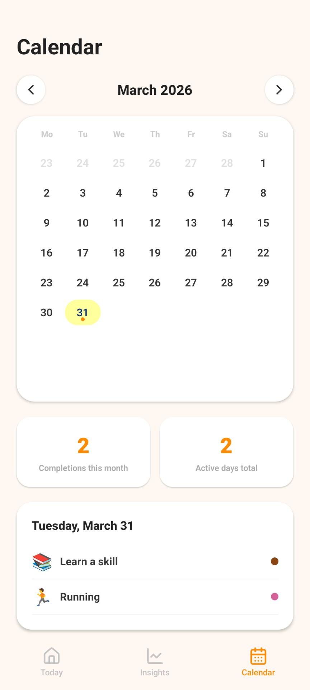
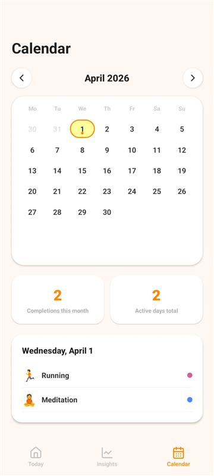

<div align="center">

<br/>

```
██╗  ██╗ █████╗ ██████╗ ██████╗ ██╗████████╗     ██████╗  ██████╗  ██████╗ ██████╗
██║  ██║██╔══██╗██╔══██╗██╔══██╗██║╚══██╔══╝    ██╔════╝ ██╔═══██╗██╔═══██╗██╔══██╗
███████║███████║██████╔╝██████╔╝██║   ██║       ██║  ███╗██║   ██║██║   ██║██║  ██║
██╔══██║██╔══██║██╔══██╗██╔══██╗██║   ██║       ██║   ██║██║   ██║██║   ██║██║  ██║
██║  ██║██║  ██║██████╔╝██████╔╝██║   ██║       ╚██████╔╝╚██████╔╝╚██████╔╝██████╔╝
╚═╝  ╚═╝╚═╝  ╚═╝╚═════╝ ╚═════╝ ╚═╝   ╚═╝        ╚═════╝  ╚═════╝  ╚═════╝ ╚═════╝
```

### _Because discipline isn't born — it's built._

<br/>


<br/>

> 🚀 **Lightweight. Private. Yours.**

<br/>

</div>

---

## 🧍 The Story Behind Habbit

> _"I'll wake up at 6AM tomorrow."_
> _"I'll start reading tonight."_
> _"I'll finally build that workout routine... next Monday."_

Sound familiar? That's basically my entire life for the past 3 years.

I'm a developer. I build things for a living. I solve problems, write systems, architect solutions — but I could **never** hold myself accountable to a simple morning routine. The irony wasn't lost on me.

I tried every habit app out there. They were either:

- 🐌 **Too slow** — opening to a loading screen every morning killed my momentum
- 🌐 **Cloud-dependent** — needing Wi-Fi just to mark a checkbox? No thanks.
- 📊 **Too complex** — I wanted to track habits, not get a psychology degree
- 👁️ **Too invasive** — sending my data to servers I don't know, for purposes I didn't agree to

So one weekend, fueled by cold coffee and mild self-loathing, I opened VS Code and started building **Habbit** — a habit tracker made by someone who desperately needed one.

This app is my accountability partner. Maybe it'll be yours too.

---

## 📱 Screenshots

<div align="center">

|           Home Screen            |                  Insights                  |                  Insights                  |                  Calendar                  |                  Calendar                  |
| :------------------------------: | :----------------------------------------: | :----------------------------------------: | :----------------------------------------: | :----------------------------------------: |
|  |  |  |  |  |

</div>

---

## 🚀 Features

### ✅ The Essentials

| Feature                     | Description                                                                |
| --------------------------- | -------------------------------------------------------------------------- |
| ☑️ **Checkbox Habits**      | Simple done/not-done tracking — meditation, journaling, cold showers       |
| ⏱️ **Timer Habits**         | Set a duration target — reading 20 mins, workout 45 mins                   |
| 🔢 **Count Habits**         | Hit a number goal — 8 glasses of water, 100 pushups                        |
| 🔥 **Streak Tracking**      | Watch your consistency stack up day after day                              |
| 🎨 **Full Personalization** | Custom icons, accent colors, and targets per habit                         |
| 🔔 **Local Notifications**  | Smart reminders that fire from your device — no server, no internet needed |

### 🛡️ Privacy & Performance (The stuff that matters)

```
🔒  Your data never leaves your phone. Ever.
📵  Works with zero internet connection.
⚡  Launches in milliseconds, not seconds.
🧹  No ads. No accounts. No cloud sync required.
🕵️  Zero analytics. Zero telemetry. We literally don't know you exist.
```

### 🏗️ Built Different

- **MMKV Storage** — Not AsyncStorage. Not SQLite. MMKV. The same key-value engine used by companies handling billions of operations. It's synchronous, tiny, and absurdly fast.
- **Offline-First Architecture** — Everything works locally. No spinners, no "connecting...", no failures because your Wi-Fi dropped.
- **Minimal Footprint** — The app won't eat your RAM or drain your battery. It does its job and stays out of your way.

---

## 🔐 Your Data. Your Phone. Full Stop.

Most apps treat your habits as data points to harvest. We don't.

```
📦  All data stored locally using MMKV on your device
🌐  No internet permission required for core features
👤  No account, no sign-up, no email required
🚫  No Firebase, no Mixpanel, no Amplitude, no analytics SDKs
🔑  Your habit history is private — not even we can see it
💀  Delete the app = delete everything. Clean slate.
```

> _"What you track is personal. Who you're becoming is nobody's business but yours."_

---

## 🔔 Notifications That Respect You

Most apps use push notifications routed through their servers — which means they know when you use the app, what habits you have, and when you're active.

Habbit does it differently.

All reminders are **local notifications** — scheduled entirely on your device, triggered by your device's clock, with zero server involvement.

```
📵  No push notification server
🌐  Works in airplane mode
👁️  We never see when or if you open a reminder
🔕  You control them — snooze, dismiss, or turn off anytime
⚙️  Per-habit scheduling — set different times for different habits
```

> _Your 6AM workout reminder is between you and your phone. Nobody else._

---

## ⚡ Performance Philosophy

Here's the thing about habit apps — you open them **every single morning**. Sometimes half-asleep. Sometimes already running late.

The last thing you need is a 3-second splash screen.

That's why Habbit uses **[MMKV](https://github.com/mrousavy/react-native-mmkv)** — a high-performance key-value storage library originally built at WeChat, handling millions of users. It's:

- 🏎️ **~30x faster** than AsyncStorage
- 📦 **Tiny** — adds minimal size to the app bundle
- ⚙️ **Synchronous** — no async/await, no Promise chains, just instant reads
- 🔋 **Battery friendly** — efficient I/O means less CPU wake time

Your habits load instantly. Your streak updates instantly. Your morning stays uninterrupted.

---

## 🛠️ Tech Stack

```
📱  React Native        — Cross-platform mobile framework
🔷  TypeScript          — Type-safe, maintainable codebase
⚡  MMKV                — Blazing fast local key-value storage
🔄  Redux Toolkit       — Predictable state management
🎨  Lucide Icons        — Clean, consistent iconography
🔔  Notifee             — Local notifications, fully on-device
```

---

## 🚀 Getting Started

### Prerequisites

```bash
node >= 18
react-native >= 0.73
```

### Installation

```bash
# Clone the repo
git clone https://github.com/Abhishek-K-Namboothiri/Habbit-Good.git
cd Habbit-Good

# Install dependencies
npm install
# or
yarn install

# iOS — install pods
cd ios && pod install && cd ..

# Run on Android
npx react-native run-android

# Run on iOS
npx react-native run-ios
```

<div align="center">

<br/>

```
Built at 2AM by someone who missed their 10PM bedtime habit.
```

**🚀 Start small. Stay consistent. Let the streaks do the talking.**

<br/>

⭐ **If this app helped you build even one good habit, drop a star. It means a lot.**

<br/>

Made with ☕ + 😤 + a lot of missed gym sessions

</div>
